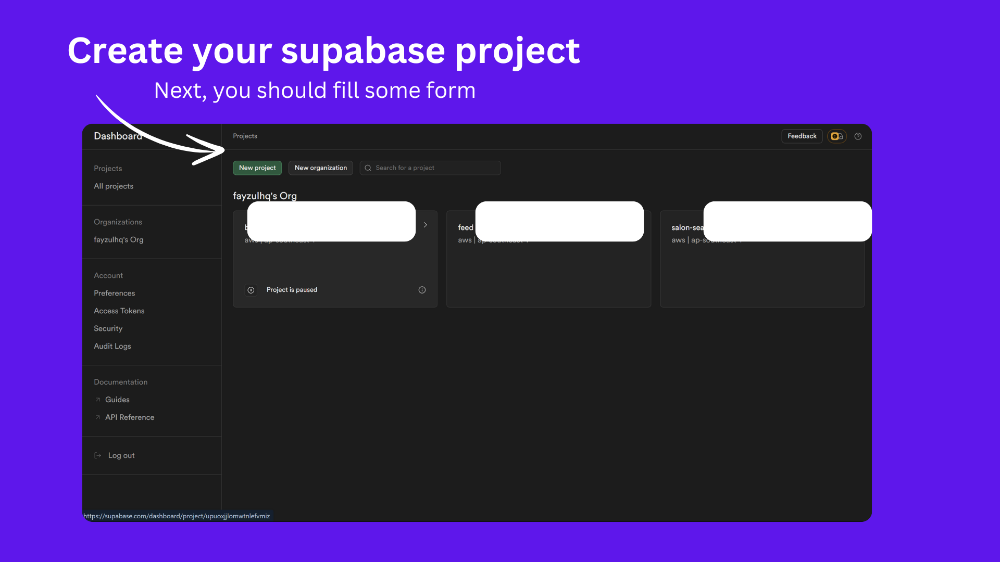
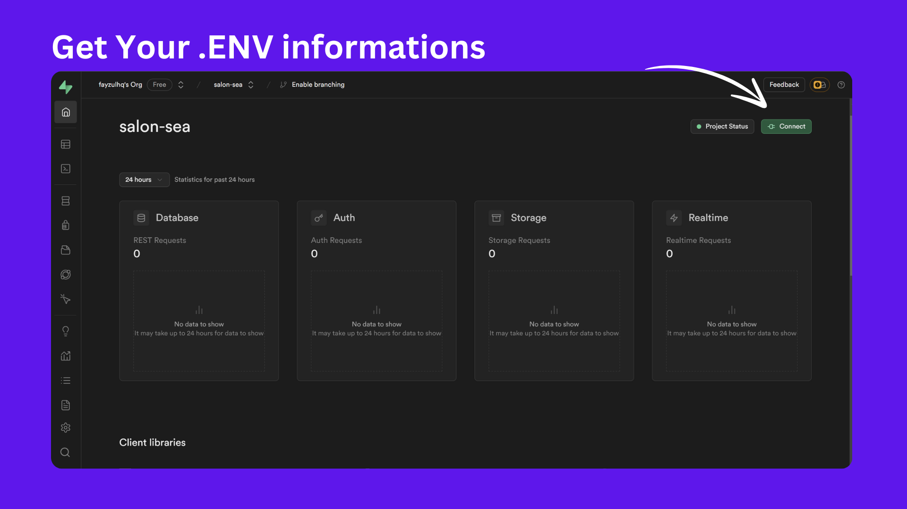
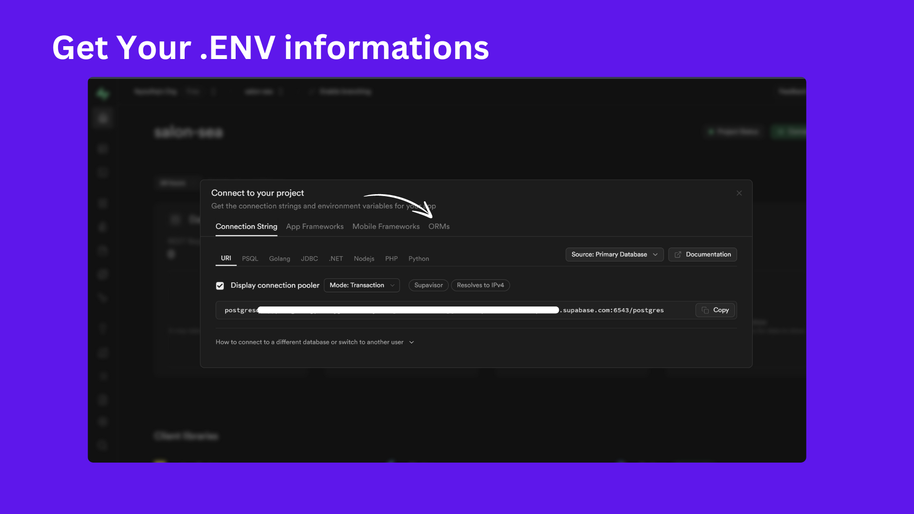
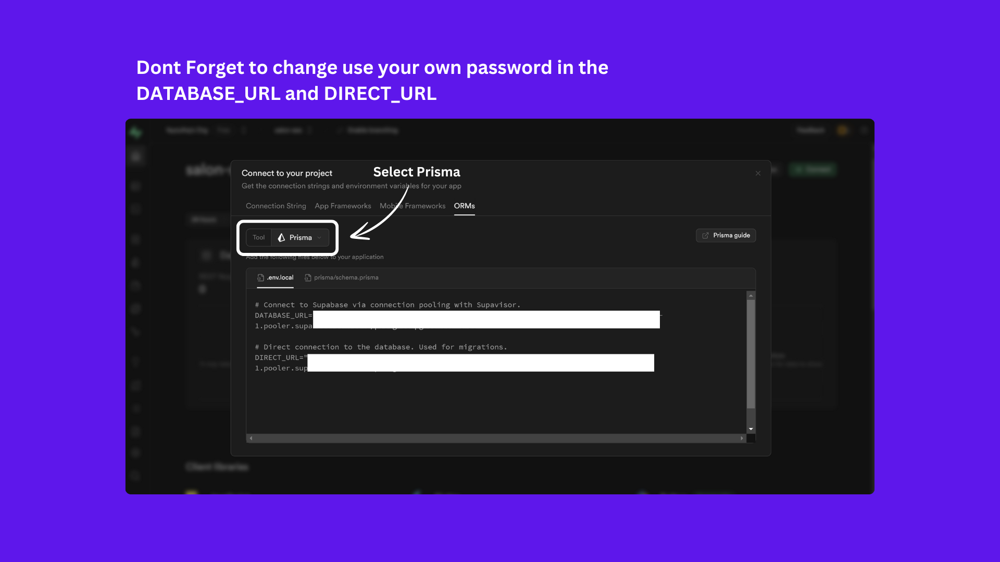

# Technical Challenge: SEA Salon

### Overview

Introducing SEA Salon, a rising star in the salon industry known for their outstanding services and excellent reviews. With a rapidly growing clientele and a stellar reputation, SEA Salon is your premier destination for all your beauty needs. Because of this, SEA Salon has gained a lot of customers. To handle the new customers, the SEA Salon management team has decided to develop a new SEA Salon Application.This app lets users easily browse available services, select their preferred stylist, and book appointments quickly. With a user-friendly interface and seamless booking integration, making a reservation with a top stylist has never been easier!The task will be divided into five progressive levels. The higher the level, the more points you can earn. Note that each level builds on the previous one, so you must complete the earlier levels before proceeding to the higher ones.

## Challange Level Overview

- Level 1: SEA Salon Home Page (10 pts) ✅
- Level 2: Interactivity! (20 pts) ✅
- Level 3: Reservation System (5 + 15 pts) ✅
- Level 4: Authentication System (20 + 5 pts) ✅
- Level 5: Advanced Reservation System (15 + 10 pts) ✅

## 1. Installation

Clone my project with

```bash
  git clone https://github.com/zpenct/SEA-Salon.git
```

Install packages

```bash
  cd SEA-salon
  pnpm install
```

## 2. Set Up Environment Variables

To run this project, you will need to add the following environment variables to your .env file. In this project, i use `DIRECT_URL` and `DATABASE_URL` that generated from Supabase.

`BASE_URL`
`AUTH_SECRET`
`DIRECT_URL`
`DATABASE_URL`

## 3. How to get your Supabase's env?






## 4. Create and seed the database

Run the following command to create your PostgreSQL database. This also creates the tables that are defined in prisma/schema.prisma:

```bash
npx prisma migrate dev

npx prisma db seed
```

When npx prisma migrate dev is executed against a newly created database, seeding is also triggered. The seed file in prisma/seed.ts will be executed and your database will be populated with the sample data.

## 5. Run App

```bash
pnpm run dev
```

Open [http://localhost:3000](http://localhost:3000) with your browser to see the result.

## 6. Screenshots


## Local Devices Setting

This project develop on:
OS: Windows 11
node: v20.11.0
pnpm: 8.15.5

## Tech Stack

**Client:** NextJs 14
**Server:** NextJs 14 and Postgres
